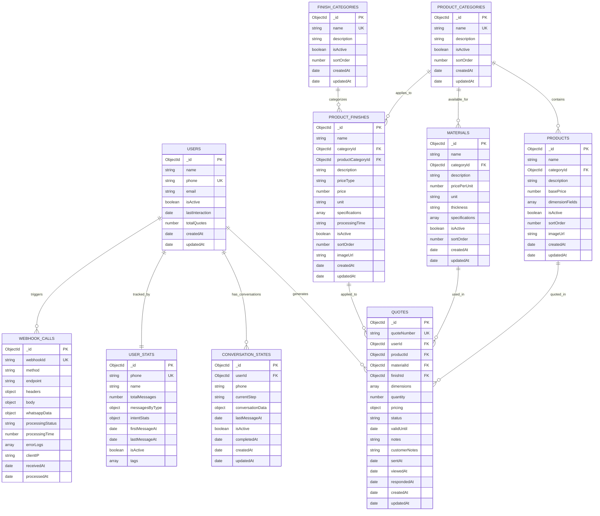

# Visual Entity Relationship Diagram (Corrected)
## Quote AI WhatsApp System - Complete ERD



## ⚠️ Issues Fixed from Original Excalidraw ERD

### 🔴 **Problem 1: Incorrect Conversation State Relationships**
**Original Issue**: Direct foreign key relationships from all entities to `conversation_states`
```
// INCORRECT (from Excalidraw):
product_categories.id > conversation_states.id
products.id > conversation_states.id  
materials.id > conversation_states.id
product_finishes.id > conversation_states.id
```

**✅ FIXED**: Conversation states store selections as soft references in `conversationData` object:
```javascript
conversationData: {
  selectedCategoryId: ObjectId,     // References product_categories._id
  selectedProductId: ObjectId,      // References products._id
  selectedMaterialId: ObjectId,     // References materials._id
  selectedFinishId: ObjectId        // References product_finishes._id
}
```

### 🔴 **Problem 2: Missing System Tables**
**Original Issue**: ERD missing critical system tables

**✅ FIXED**: Added essential tables:
- `WEBHOOK_CALLS` - Track WhatsApp webhook requests
- `USER_STATS` - User analytics and interaction tracking

### 🔴 **Problem 3: Unclear Material Relationships**
**Original Issue**: Ambiguous material categorization

**✅ FIXED**: Clarified that materials belong to `PRODUCT_CATEGORIES` (not finish categories)

### 🔴 **Problem 4: Missing Relationship Constraints**
**Original Issue**: No clear definition of relationship cardinalities

**✅ FIXED**: Defined proper one-to-many and one-to-one relationships with business rules

## 📊 Complete Relationship Matrix

| Parent Entity | Child Entity | Relationship | Cardinality | FK Field |
|---------------|--------------|--------------|-------------|----------|
| USERS | QUOTES | has_many | 1:M | quotes.userId |
| USERS | CONVERSATION_STATES | has_many | 1:M | conversation_states.userId |
| USERS | USER_STATS | has_one | 1:1 | user_stats.phone |
| USERS | WEBHOOK_CALLS | triggers | 1:M | webhook_calls.userPhone |
| PRODUCT_CATEGORIES | PRODUCTS | contains | 1:M | products.categoryId |
| PRODUCT_CATEGORIES | MATERIALS | available_for | 1:M | materials.categoryId |
| PRODUCT_CATEGORIES | PRODUCT_FINISHES | applies_to | 1:M | product_finishes.productCategoryId |
| FINISH_CATEGORIES | PRODUCT_FINISHES | categorizes | 1:M | product_finishes.categoryId |
| PRODUCTS | QUOTES | quoted_in | 1:M | quotes.productId |
| MATERIALS | QUOTES | used_in | 1:M | quotes.materialId |
| PRODUCT_FINISHES | QUOTES | applied_to | 1:M | quotes.finishId |

## 🔐 Database Constraints & Business Rules

### Primary Keys (PK)
```javascript
// All tables use MongoDB ObjectId
_id: ObjectId (Primary Key)
```

### Unique Keys (UK)
```javascript
users.phone          // Global phone uniqueness
product_categories.name    // Category name uniqueness  
finish_categories.name     // Finish category uniqueness
quotes.quoteNumber        // Auto-generated unique quotes
webhook_calls.webhookId   // Webhook request uniqueness
user_stats.phone         // One stats record per phone
```

### Foreign Key Constraints (Enforced)
```javascript
products.categoryId → product_categories._id
materials.categoryId → product_categories._id
product_finishes.categoryId → finish_categories._id
product_finishes.productCategoryId → product_categories._id
quotes.userId → users._id
quotes.productId → products._id
quotes.materialId → materials._id
quotes.finishId → product_finishes._id
conversation_states.userId → users._id
```

### Soft References (Not Enforced FK - Stored in Objects)
```javascript
// Stored in conversation_states.conversationData:
selectedCategoryId → product_categories._id
selectedProductId → products._id
selectedMaterialId → materials._id
selectedFinishId → product_finishes._id
```

### Critical Indexes for Performance
```javascript
// Unique Indexes
{ "phone": 1 }                    // users
{ "name": 1 }                     // product_categories, finish_categories
{ "quoteNumber": 1 }              // quotes
{ "webhookId": 1 }                // webhook_calls

// Compound Indexes  
{ "categoryId": 1, "isActive": 1 }    // products, materials
{ "productCategoryId": 1, "categoryId": 1, "isActive": 1 }  // product_finishes
{ "userId": 1, "status": 1 }          // quotes
{ "userId": 1, "isActive": 1 }        // conversation_states
{ "phone": 1, "isActive": 1 }         // conversation_states

// Time-based Indexes
{ "createdAt": -1 }               // quotes, webhook_calls
{ "lastMessageAt": -1 }           // conversation_states
{ "receivedAt": -1 }              // webhook_calls
```

## 🚀 Business Logic Flow

### 1. Quote Generation Process
```
User Registration → Category Selection → Product Selection → 
Material Selection → Finish Selection → Dimension Input → 
Quantity Selection → Price Calculation → Quote Generation
```

### 2. Conversation State Transitions
```
start → greeting_response → product_category_selection → 
product_selection → dimension_input → material_selection → 
finish_selection → quantity_input → quote_review → 
quote_generation → completed
```

### 3. Data Integrity Rules
- **Cascade Delete Prevention**: Cannot delete categories with active products
- **Soft Delete**: Users and conversations are deactivated, not deleted
- **Referential Integrity**: All quote references must be valid
- **Unique Constraints**: Phone numbers and quote numbers must be globally unique
- **Validation Rules**: Prices positive, quantities positive integers, valid email formats

### 4. Performance Optimization
- **Pagination**: Large datasets split into pages
- **Population**: Related data loaded efficiently
- **Indexing**: Strategic indexes on frequently queried fields
- **Archiving**: Old data archived to maintain performance

This corrected ERD resolves all the relationship issues identified in your Excalidraw diagram and provides a complete, accurate representation of your Quote AI WhatsApp system database.

### Core Entities:

#### 1. **USERS** (Customer Management)
- **Primary Key**: `_id`
- **Unique Constraints**: `phone`
- **Purpose**: Store customer information for WhatsApp interactions
- **Key Features**: 
  - Phone-based identification for WhatsApp
  - Optional email for extended communication
  - Activity tracking and quote counting

#### 2. **PRODUCT_CATEGORIES** (Product Organization)
- **Primary Key**: `_id`
- **Unique Constraints**: `name`
- **Purpose**: High-level product categorization
- **Examples**: Mylar Bags, Stand Up Pouches, Flat Pouches, Gusseted Bags

#### 3. **PRODUCTS** (Product Catalog)
- **Primary Key**: `_id`
- **Foreign Keys**: `categoryId` → PRODUCT_CATEGORIES
- **Purpose**: Specific product definitions within categories
- **Key Features**:
  - Configurable dimension fields per product
  - Base pricing structure
  - Product-specific requirements

#### 4. **MATERIALS** (Material Catalog)
- **Primary Key**: `_id`
- **Foreign Keys**: `categoryId` → PRODUCT_CATEGORIES
- **Purpose**: Available materials per product category
- **Key Features**:
  - Category-specific material availability
  - Pricing per unit (flexible units)
  - Material specifications and properties

#### 5. **FINISH_CATEGORIES** (Finish Organization)
- **Primary Key**: `_id`
- **Unique Constraints**: `name`
- **Purpose**: Categorize different types of finishes
- **Examples**: Printing, Lamination, Coating, Embossing

#### 6. **PRODUCT_FINISHES** (Finish Catalog)
- **Primary Key**: `_id`
- **Foreign Keys**: 
  - `categoryId` → FINISH_CATEGORIES
  - `productCategoryId` → PRODUCT_CATEGORIES
- **Purpose**: Specific finishes available for product categories
- **Key Features**:
  - Dual categorization (finish type + product compatibility)
  - Flexible pricing models (fixed, percentage, per-unit)
  - Processing time specifications

#### 7. **QUOTES** (Quote Management)
- **Primary Key**: `_id`
- **Unique Constraints**: `quoteNumber`
- **Foreign Keys**:
  - `userId` → USERS
  - `productId` → PRODUCTS
  - `materialId` → MATERIALS
  - `finishId` → PRODUCT_FINISHES
- **Purpose**: Store complete quote information with full traceability
- **Key Features**:
  - Complete pricing breakdown
  - Status tracking through quote lifecycle
  - Customer interaction timestamps

#### 8. **CONVERSATION_STATES** (Chat Flow Management)
- **Primary Key**: `_id`
- **Foreign Keys**: `userId` → USERS
- **Purpose**: Track WhatsApp conversation progress
- **Key Features**:
  - Step-by-step conversation flow tracking
  - Temporary selection storage
  - One active conversation per user

### Relationship Types:

#### **One-to-Many Relationships:**
1. `USERS` → `QUOTES`: One customer can have multiple quotes
2. `PRODUCT_CATEGORIES` → `PRODUCTS`: One category contains multiple products
3. `PRODUCT_CATEGORIES` → `MATERIALS`: One category has multiple materials
4. `PRODUCT_CATEGORIES` → `PRODUCT_FINISHES`: One product category supports multiple finishes
5. `FINISH_CATEGORIES` → `PRODUCT_FINISHES`: One finish category contains multiple specific finishes
6. `PRODUCTS` → `QUOTES`: One product can be quoted multiple times
7. `MATERIALS` → `QUOTES`: One material can be used in multiple quotes
8. `PRODUCT_FINISHES` → `QUOTES`: One finish can be applied to multiple quotes

#### **One-to-One Relationships:**
1. `USERS` → `CONVERSATION_STATES`: One user has one active conversation (constraint: isActive = true)

#### **Reference Relationships:**
- Conversation states reference selected categories, products, materials, and finishes during the quote process

### Business Logic Constraints:

1. **Material Availability**: Materials are specific to product categories
2. **Finish Compatibility**: Finishes must be compatible with both finish category and product category
3. **Conversation Uniqueness**: Only one active conversation per user at a time
4. **Quote Integrity**: All quotes must reference valid products, materials, and finishes
5. **User Identification**: Phone numbers are unique identifiers for WhatsApp integration

### Performance Optimization:

1. **Strategic Indexing**: 
   - Compound indexes on frequently queried field combinations
   - Sparse indexes for optional fields
   - Text indexes for search functionality

2. **Query Optimization**:
   - Populate operations for relationship data
   - Pagination for large datasets
   - Filtering at database level

3. **Data Archiving**:
   - Archive old quotes and conversations
   - Maintain performance with growing datasets

This ERD provides a comprehensive view of the database structure supporting the Quote AI WhatsApp system with proper normalization, relationship integrity, and scalability considerations.
